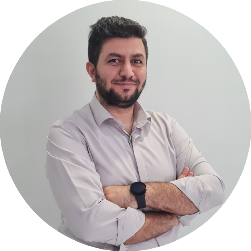

# Alireza Hamidi

### Programmer and Web Developer

I have over 4 Years experience working in Frontend Teams.
Currently, I work on my personal and community projects and looking for a job to make more experince for me and I enjoy working in team, teach new technologies and gain more experience.
I'm hard working person and deliver projects before dead lines make me so proded of my self.
Please Visit My [GitHub](https://github.com/alirezahamidi) to see My Open Projects.
#

#### Key Skills
------------
Html/Html 5, Css/Css 3, Sass, Less, Bootstrap 3+, Js, Node.js, Angular, Ngrx, Rxjs, React, Next.Js, Electron.js, C#, Asp.Net Core ( MVC/Rest Api ), Windows Form, Mysql, Sql Server, Jquery, Git, Scrum

#

#### Job Experiences

-------------

Inpress - Belgium (Remote from Tehran,Iran)

Senior Frontend Developer

Sep 2023 - Oct 2023

Key Responsibilities : Design scalable angular pages and components.

(Angular, RxJs, Ngrx)

$${\color{red}Stopped\space working\space due\space project\space cancelation}$$

-------------

Yektapars Vista - Tehran,Iran (In-Site)

Senior Frontend Developer

Nov 2022 - Sep 2023

Key Responsibilities : Design Webpages, Maintain Prebuilt Projects and Change views to Make Designed UI/UX Figma designs.

[Tirehub.ir](https://tirehub.ir) << Click to see the website

(Dotnet Core 6, Razor, SqlServer, Pure HTML/CSS, Vanila Js)

------------

Yes Doctor - USA (Remote from Tehran,Iran)

Frontend Developer

Apr 2022 - Nov 2022 · 8 mos

Key Responsibilities : Participate in 4 Projects that made for Doctor 
Appointment and Manage it.

[Yesdoctor.com](https://www.yesdoctor.com/) << Click to see the website

(Angular 11, Angular 12, Angular 13, RXJS)

------------

Joint Scope Technologies - Dubai,UAE (Remote from Tehran,Iran)

Senior Frontend Developer and Lead of Fontend Team

Jan 2021 - Apr 2022, 16 Months

Key Responsibilities : Maintain two project that made to manage Dubai Police Fleet, Lead a team of Frontend Developers to Follow Product team and Create Maintainable Panel to revamp Earlier projects to manage Dubai Police Fleet.

(Angular 10, Angular 11, RXJS, NGRX)

------------

Mealsy.ca - Canada (Remote from Tehran,Iran)

Frontend Developer

Oct 2020 - Jan 2021, 4 Months

Key Responsibilities : Create Pages, Components and State Managers For POS Application Devices, Food Oridering Website and Related Management Web Applications

[Mealsy.ca](https://mealsy.ca/) << Click to see the website

(Angular 9, NGRX, RXJS)

------------

Bam Pardazesh Tehran - Tehran,Iran (In-Site)

Frontend Developer (Angular)

May 2020 - Oct 2020, 6 Months

Key Responsibilities : Create Pages and Components to Provide Human Resource and Accounting Web Application

(Angular 5)

------------

Full Stack Web Developer

Rayadars - Tehran,Iran (In-Site)

Node Js (Express.Js) Backend - Angular Frontend

Jun 2017 - Mar 2018, 10 Months

Key Responsibilities : Create Web Pages and Services for a Learning Management System

(Angular 2, Nodejs, ExpressJs, Apache CouchDB, Nginx, Redis)

-------------

# Projects

Fanavaran Management App

Senior Frontend Developer

Worked on ui of an android application that made for managers to see their's cartable and accept or decline their requests.

June 2023 - Aug 2023

Angular , Ionic

-------------

TinTech

Senior Frontend Developer

This is a team of developers that wanted to start their's business and i made two landing page for this team that i'm a member of it.

[Tintech.be](https://tintech.be) << Click to see the website

[Homevox.eu](https://homevox.eu/en) << Click to see the website

-------------

Hope you enjoyed my experinces and i know we have more to discuss.

Hope to hear from you and feel free to contact me for any subject.

[alirezahamidi.dev@gmail.com](mail://alirezahamidi.dev@gmail.com) <<  My Email

[+98 935 083 29 05](tel://+989350832905) <<  My Phone number on Whatsapp Or Telegram

# Thanks for your Time!

Alireza Hamidi
